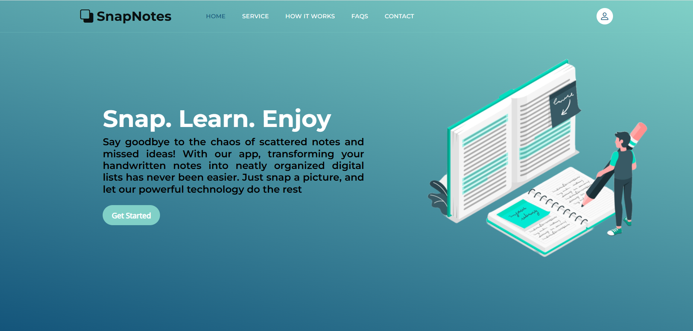
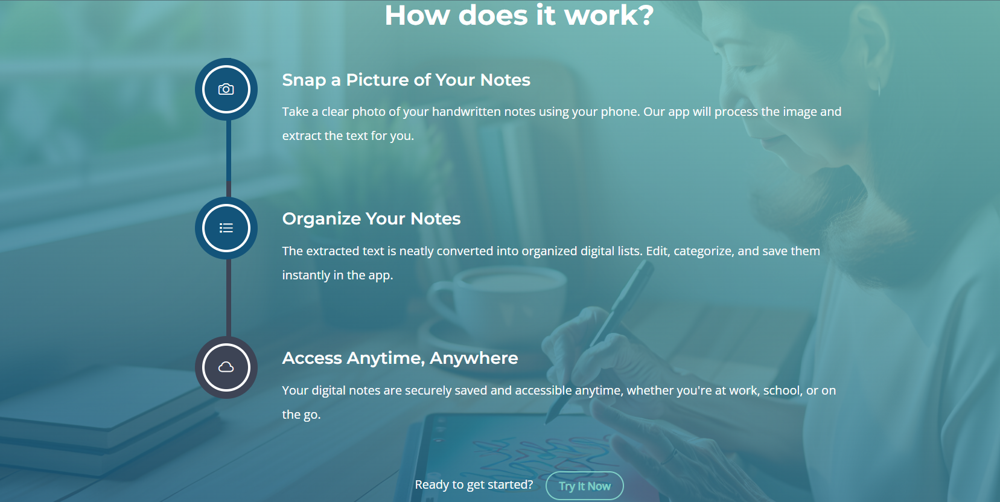

# 📝 SnapNote – Intelligent Handwritten Notes Digitization

**SnapNote** is a smart AI-based web platform designed to transform handwritten notes into structured, searchable digital content. By simply uploading an image, the system extracts handwritten text and automatically organizes it into meaningful categories.

This project aims to simplify note management for students and professionals by combining computer vision and natural language understanding.

---

## ✨ Project Highlights

- 📤 **Image Upload**
  Upload photos or scanned images of handwritten notes through a simple web interface.

- 🤖 **AI-Powered Text Recognition**
  Leverages a multimodal vision-language model to accurately extract handwritten text from images.

- 🏷️ **Automatic Content Tagging**
  Uses semantic understanding to classify extracted text into relevant categories without prior training.

- 📚 **Clean & Structured Results**
  Extracted notes are displayed in an organized way, grouped by topic for easier navigation.

---

## 🧠 Artificial Intelligence Pipeline

### ✍️ Handwritten Text Recognition
- **Model Used**: `microsoft/Florence-2-base`
- **Purpose**: Converts handwritten content in images into digital text.

### 🏷️ Semantic Classification
- **Model Used**: `facebook/bart-large-mnli`
- **Purpose**: Categorizes notes using zero-shot learning (e.g., Tasks, Science, Personal Notes).

Example usage:
```python
from transformers import pipeline

classifier = pipeline(
    task="zero-shot-classification",
    model="facebook/bart-large-mnli"
)

classifier(
    "Prepare chemistry revision notes for tomorrow.",
    candidate_labels=["To-Do", "Science", "Personal", "Education"]
)
```
## 🖥️ Application Preview

### 🎬 Demo Video
A short demonstration of the application is available here:  
👉 [Project Demo – Google Drive](https://drive.google.com/file/d/1kUx6_gbdVDXruDt3Ouwznj6sTTLoj6vw/view)

### 🖼️ Screenshots
  


---

## 🛠️ Technologies Used

### Frontend
- HTML  
- CSS  
- JavaScript  

### Backend
- Python  
- Flask (API & model orchestration)

### AI & NLP
- Hugging Face Transformers  
- Florence-2 for handwritten text extraction  
- BART-MNLI for semantic text classification  

### Data Handling
- Local storage for uploaded images and processed outputs

---

## ⚙️ Local Setup Guide

### Step 1 – Clone the repository
```bash
git clone https://github.com/AjgagalAsma/SnapNotes.git
```
### Step 2 – Navigate to the project directory
```bash
cd snapnote
```
### Step 3 – Create and activate the environment
Make sure Conda is installed, then run:
```bash
conda env create -f environment.yaml -n snapnote_env
conda activate snapnote_env
```

### Step 4 – Run the application
```bash
python app.py
```
The application will be available at:
👉 http://localhost:5000
